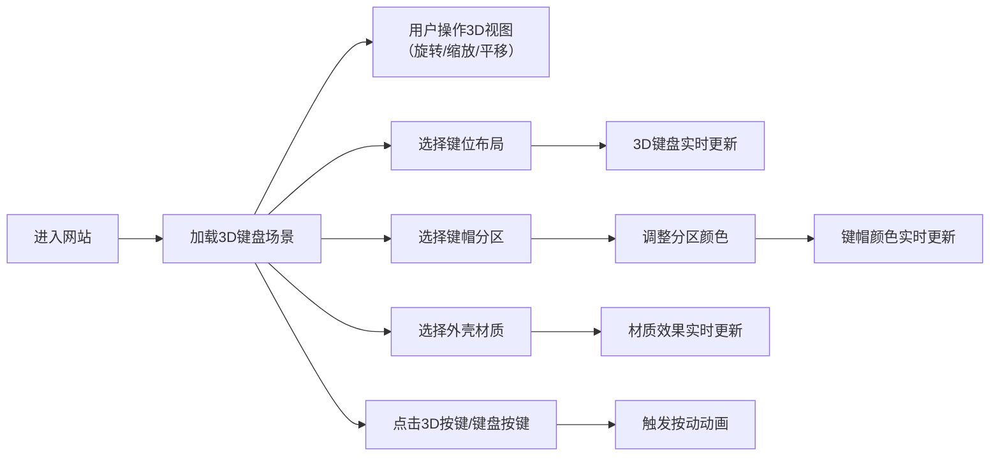

## 1. 产品概述

DIY键盘工坊是一个交互式3D键盘定制网站，让用户可以在浏览器中实时预览和定制自己的专属键盘。通过直观的3D界面，用户可以选择键位布局、自定义各区域键帽颜色、切换键盘材质，并获得真实的按键反馈体验。

- **核心价值**：降低键盘定制门槛，让用户在购买前即可预览定制效果
- **目标用户**：机械键盘爱好者、电竞玩家、设计师、追求个性化的数码用户
- **市场定位**：轻量级Web端3D键盘定制预览工具，无需安装即可体验

## 2. 核心功能

### 2.1 用户角色

| 角色 | 注册方式 | 核心权限 |
|------|----------|----------|
| 访客用户 | 无需注册 | 体验完整3D定制功能，预览所有效果 |

### 2.2 功能模块

1. **首页/主界面**：3D键盘展示区、定制控制面板、实时交互
2. **3D键盘场景**：可旋转、缩放的3D键盘模型，支持视角切换
3. **键位布局选择**：60%、65%、75%、TKL、全尺寸等多种布局切换
4. **键帽颜色定制**：按功能分区（字母区、功能键区、数字区、修饰键区）独立调色
5. **材质选择**：键盘外壳材质（铝合金、塑料、木质等）切换
6. **按键交互**：点击/按键触发3D按键按压动画和视觉反馈

### 2.3 页面详情

| 页面名称 | 模块名称 | 功能描述 |
|----------|----------|----------|
| 主页面 | 3D展示区 | 实时渲染3D键盘，支持鼠标拖动旋转、滚轮缩放、右键平移 |
| 主页面 | 布局选择器 | 下拉选择不同键位布局（60%/65%/75%/TKL/Full） |
| 主页面 | 分区颜色面板 | 选择键盘分区，使用颜色选择器调整该区域键帽颜色 |
| 主页面 | 材质选择器 | 切换键盘外壳材质，实时更新3D渲染效果 |
| 主页面 | 交互提示 | 引导用户进行3D操作和按键交互 |

## 3. 核心流程

用户进入网站后，首先看到默认布局的3D键盘。可以通过鼠标操作3D场景，也可以在右侧控制面板中进行定制：选择键位布局→选择要定制的分区→调整颜色→选择外壳材质→点击3D键盘上的按键体验按动效果。

## 4. 用户界面设计

### 4.1 设计风格

- **主色调**：深色科技风格，以深灰/黑色为基底，搭配霓虹蓝/紫色作为点缀
- **辅助色**：金属银、哑光质感
- **按钮风格**：圆角矩形，带微妙阴影和悬停动效，点击有按压反馈
- **字体**：现代无衬线字体，标题使用具有未来感的字体，正文清晰易读
- **布局风格**：左侧大面积3D展示区，右侧固定控制面板，半透明玻璃态设计
- **图标风格**：简洁线性图标，与整体科技感一致

### 4.2 页面设计概述

| 页面名称 | 模块名称 | UI元素 |
|----------|----------|----------|
| 主页面 | 3D展示区 | 全屏深色背景，带微妙网格/光晕效果，3D键盘居中展示，底部有操作提示 |
| 主页面 | 控制面板 | 右侧固定宽度面板，半透明玻璃质感，分组展示各控制选项，带图标和标签 |
| 主页面 | 颜色选择器 | 预设颜色快选 + 自定义取色器，支持历史颜色记录 |
| 主页面 | 分区选择 | 可视化分区示意图，点击选中对应区域，高亮显示 |

### 4.3 响应式设计

- **桌面端优先**：左侧70%区域为3D展示，右侧30%为控制面板
- **平板适配**：控制面板改为底部抽屉式，可上滑展开
- **移动端**：简化控制选项，支持触摸手势操作3D场景
- **触摸优化**：支持单指旋转、双指缩放和平移

### 4.4 3D场景指导

- **环境/HDRI**：使用工作室风格HDR环境贴图，营造专业产品展示氛围，适当的反射和阴影
- **光照设置**：主光源+补光+轮廓光的三点布光，突出键盘的质感和细节，按键区域有重点照明
- **相机设置**：默认45度俯视角，支持轨道控制，限制合理的旋转和缩放范围
- **相机运动**：页面加载时相机从远处平滑推进到默认位置，切换布局时相机有过渡动画
- **构图和焦点元素**：键盘始终位于视觉中心，背景简洁不抢戏，按键为主要交互焦点
- **交互和动画**：按键按动有Z轴位移+微妙旋转，颜色切换有淡入过渡，材质切换有高光扫过效果
- **后处理效果**：轻微的环境光遮蔽（AO）、抗锯齿、色彩校正，整体画面通透有质感
- **性能预算**：单个键盘模型控制在合理面数，优先保证60fps流畅度
