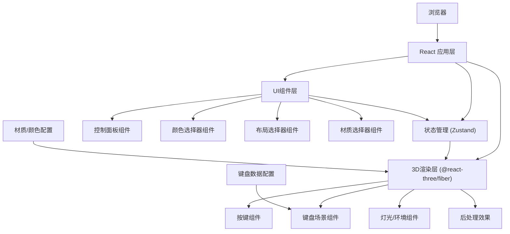

## 1. 架构设计



## 2. 技术描述

- **前端框架**: React@18 + TypeScript
- **构建工具**: Vite@5
- **样式方案**: TailwindCSS@3
- **3D引擎**: Three@0.160 + @react-three/fiber@8 + @react-three/drei@9
- **后处理**: @react-three/postprocessing@2
- **状态管理**: Zustand@4
- **图标库**: lucide-react@0.300
- **后端**: 无（纯前端应用）
- **数据库**: 无（本地配置数据）

## 3. 路由定义

| 路由 | 用途 |
|------|------|
| / | 主页面 - 3D键盘定制界面 |

## 4. 核心数据结构

### 4.1 键盘布局类型定义

```typescript
type LayoutType = '60%' | '65%' | '75%' | 'TKL' | 'Full';

interface KeyConfig {
  id: string;
  label: string;
  x: number;
  y: number;
  width: number;
  height: number;
  row: number;
  col: number;
  zone: KeyZone;
  keyCode?: string;
}

interface LayoutConfig {
  type: LayoutType;
  name: string;
  description: string;
  keys: KeyConfig[];
  width: number;
  height: number;
}
```

### 4.2 键盘分区类型

```typescript
type KeyZone = 
  | 'alphanumeric'    // 字母数字区
  | 'function'        // 功能键区
  | 'navigation'      // 导航键区
  | 'numpad'          // 数字键盘区
  | 'modifiers'       // 修饰键区
  | 'spacebar';       // 空格键区
```

### 4.3 定制状态

```typescript
interface KeyboardState {
  layout: LayoutType;
  caseMaterial: CaseMaterial;
  zoneColors: Record<KeyZone, string>;
  pressedKeys: Set<string>;
}

type CaseMaterial = 'aluminum' | 'plastic' | 'wood' | 'carbon';
```

### 4.4 材质配置

```typescript
interface MaterialConfig {
  id: CaseMaterial;
  name: string;
  color: string;
  roughness: number;
  metalness: number;
  normalScale?: number;
}
```

## 5. 项目结构

```
src/
├── components/
│   ├── Keyboard3D/          # 3D键盘相关组件
│   │   ├── KeyboardScene.tsx
│   │   ├── KeyboardCase.tsx
│   │   ├── KeyCap.tsx
│   │   └── Lights.tsx
│   ├── ControlPanel/        # 控制面板组件
│   │   ├── ControlPanel.tsx
│   │   ├── LayoutSelector.tsx
│   │   ├── ZoneColorPicker.tsx
│   │   └── MaterialSelector.tsx
│   └── UI/                   # 通用UI组件
│       ├── ColorPicker.tsx
│       └── PresetColors.tsx
├── store/
│   └── useKeyboardStore.ts  # Zustand状态管理
├── data/
│   ├── layouts.ts           # 键盘布局配置数据
│   ├── materials.ts         # 材质配置数据
│   └── zones.ts             # 分区配置数据
├── types/
│   └── keyboard.ts          # 类型定义
├── hooks/
│   └── useKeyboardPress.ts  # 键盘事件监听Hook
├── pages/
│   └── Home.tsx             # 主页
├── App.tsx
├── main.tsx
└── index.css
```

## 6. 核心组件说明

### 6.1 KeyboardScene.tsx
- 3D场景容器，管理相机、轨道控制器
- 加载键盘布局数据，渲染键盘外壳和所有按键
- 处理后处理效果（AO、抗锯齿等）

### 6.2 KeyCap.tsx
- 单个按键组件，根据分区颜色渲染
- 处理按键按动动画（Z轴位移、缩放）
- 支持点击交互触发按压效果

### 6.3 KeyboardCase.tsx
- 键盘外壳组件，根据材质配置渲染
- 动态更新材质属性（颜色、粗糙度、金属度）

### 6.4 useKeyboardStore.ts
- 全局状态管理：当前布局、材质、分区颜色、按键状态
- 提供actions切换布局、更新颜色、切换材质、更新按键状态

### 6.5 useKeyboardPress.ts
- 监听物理键盘事件
- 映射按键到3D场景中的对应按键
- 触发按键按压动画

## 7. 性能优化策略

1. **3D性能**：
   - 使用InstancedMesh批量渲染相同形状的按键
   - 合理控制几何体分段数
   - 启用frustumCulling剔除不可见物体

2. **状态更新**：
   - 使用Zustand的selectors避免不必要的重渲染
   - 颜色/材质更新使用useTransition实现平滑过渡

3. **资源加载**：
   - 预生成所有几何体，避免运行时重复创建
   - 使用HDR环境贴图的压缩版本
